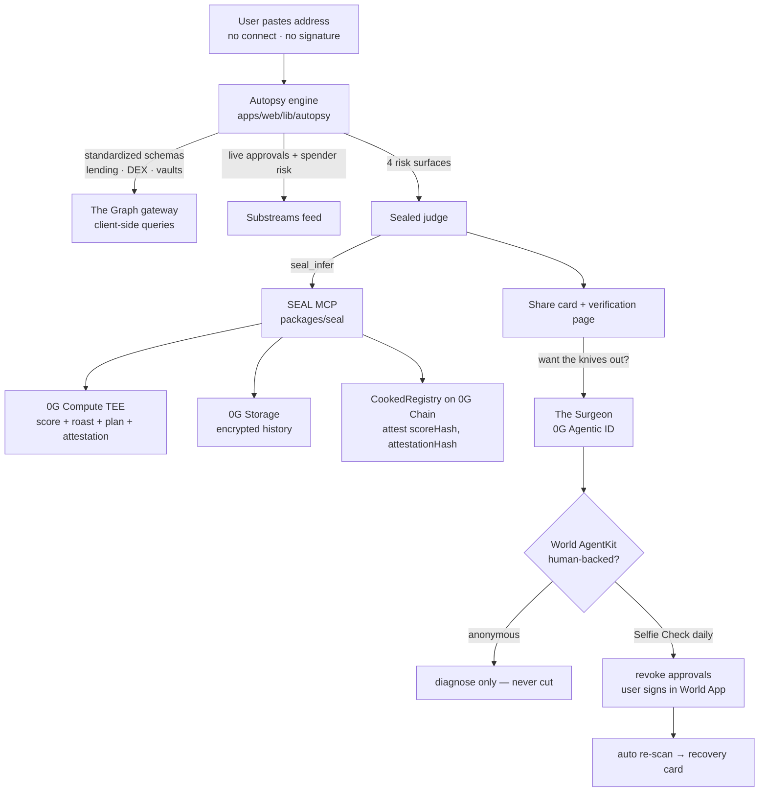

# AM I COOKED? 🍳🔪

**Everyone got cooked this year. The only question is how much.**

Paste any wallet address. A cross-protocol autopsy (The Graph, standardized schemas)
finds your exploit exposure, live dangerous approvals, dead-protocol bags, and your
single worst day. A sealed judge inside a **0G Compute TEE** stamps your cooked score
(0–100) with an attestation anchored on **0G Chain** — then the **Surgeon**, a
0G-Agentic-ID agent that may only act with **World-verified human backing**, pulls the
knives out: revokes the dangerous approvals, live. Misery goes viral (68% cooked 💀);
recovery brings you back (68 → 31 🔪→🩹).

**Live prototype:** https://freenodalvpn.xyz/cooked/ (installable PWA)

## Architecture

**Hard rule:** the app contains zero 0G SDK imports — every 0G call goes through
[SEAL](packages/seal/), our standalone MCP server.

## Monorepo

| Path | What |
|---|---|
| `apps/web/` | The app (PWA prototype v7 → real build). 27-assertion e2e suite. |
| `packages/seal/` | SEAL — 0G-as-MCP-tools. 8 tools, stub+live modes, goldfish example, 6 tests. |
| `packages/cooked-skill/` | Planned: reusable address→risk-profile SKILL (Graph AI Tooling). |
| `contracts/` | `CookedRegistry.sol` — rubric hash committed at deploy; verdicts anchored, first-write-wins. |

## Status

- [x] Product prototype: 4 screens, animated, tested (27/27), deployed as PWA
- [x] SEAL skeleton: 8 frozen tool signatures, stub backend with self-verifying attestations, goldfish e2e (6/6 tests)
- [x] Registry contract written
- [ ] 0G live wiring (Compute/Storage/Agentic ID) — pending venue desk check
- [ ] The Graph gateway key + real standardized-schema queries
- [ ] World MiniKit (Selfie / Identity / AgentKit) integration
- [ ] Registry deployed to 0G testnet + verification page

## Honesty notes

Scores in the prototype are staged demo data. The privacy claim is precise: *scoring*
happens in a TEE and addresses are never stored server-side; Graph queries run
client-side. The Surgeon never holds keys — it proposes transactions, the human signs
in World App. Prices move both ways; revoking approvals removes attack surface, it
doesn't recover what's gone.
