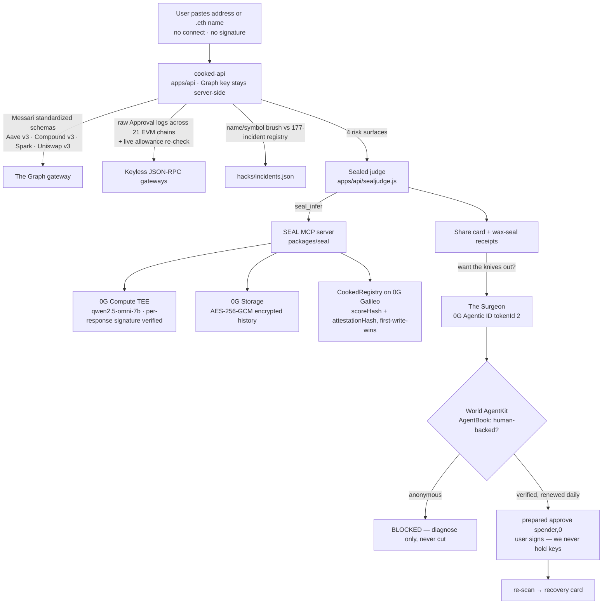

# AM I COOKED? 🍳🔪

**Everyone got cooked this year. The only question is how much.**

Paste any wallet address — no connect, no signature. A cross-protocol autopsy finds your
exploit exposure, every dangerous token approval still open right now, dead-protocol
bags, and your single worst day. A sealed judge inside a **0G Compute TEE** stamps your
cooked score (0–100) with a verifiable attestation, anchored on **0G Chain** against a
rubric whose hash was committed at deploy. Then the **Surgeon** — an agent carrying a
**0G Agentic ID** that may only act with **World-verified human backing** — pulls the
knives out: it prepares the revocations, you sign them. Misery goes viral (68% cooked 💀);
recovery brings you back (68 → 31 🔪→🩹).

**Live:** https://tracely.live/cooked/ · mirror https://freenodalvpn.xyz/cooked/
(installable PWA — four demo wallets answer instantly, any address or `.eth` name works)

## Architecture



**Hard rule:** the app contains zero 0G SDK imports — every 0G call goes through
[SEAL](packages/seal/), our standalone MCP server. Swapping SEAL's stub backend for the
live one required no changes in product code.

## Deployed on 0G Galileo (chain 16602)

| What | Address | Proof |
|---|---|---|
| CookedRegistry | `0x5d6093C9C6f9118dBD6ae87770dB1E964D06CFcE` | on-chain `rubricHash` equals `keccak256(contracts/rubric.md)`; the judge refuses to seal a verdict if they diverge |
| AgenticID | `0x584E00F2a526AB3a3966237c376e97BC6f8338F2` | the Surgeon holds tokenId 2, metadata encrypted |

TEE inference and encrypted Storage round-trips are verified live, not stubbed —
attestation signatures are checked per response.

## Monorepo

| Path | What |
|---|---|
| `apps/web/` | The app: framework-free vanilla-JS PWA, service worker, installable. 27-assertion Playwright e2e against the live URL. |
| `apps/api/` | Scan service (`node:http` + viem): autopsy, 21-chain approvals engine, sealed judge, guardian alarms, share-card renderer, Surgeon endpoints. 24 unit tests over mocked JSON-RPC. |
| `packages/seal/` | **SEAL** — 0G as 8 MCP tools (Bun + TypeScript): sealed inference, encrypted memory, chain calls, Agentic ID. Stub and live backends, example agents, 7 tests. |
| `packages/cooked-skill/` | The autopsy engine as a reusable MCP server + agent SKILL — address in, risk profile out. 21 tests. |
| `contracts/` | `CookedRegistry.sol`, `AgenticID.sol`, and `rubric.md` — the scoring law the registry hash commits to. |
| `hacks/` | Curated incident registry: 177 incidents, 40 attacker/contract addresses, independently spot-checked. |

## How the numbers are produced

Nothing is mocked or staged. Every figure in a verdict comes from live chain data:

- **Lending and DEX exposure** — The Graph gateway, one Messari-standardized query shape
  across Aave v3, Compound v3 and Spark; adding a conforming market is one registry line.
  Uniswap v3 rides the same registry with its own dialect.
- **Live approvals** — no indexer involved: raw ERC-20 `Approval` logs via `eth_getLogs`
  across 21 EVM mainnets (chunked fallback for stingy RPCs), then every surviving
  `(token, spender)` pair re-checked with a live `allowance()` call. The call is the
  source of truth, and a failed re-check fails **closed** — it stays an open wound
  flagged unverified rather than silently reading as revoked.
- **Exploit exposure** — a word-level brush against the curated incident registry. It is
  labelled as a brush in the UI, not proof of loss.
- **Guardian alarms** — top-pool TVL polled through the gateway, firing on ≥25% outflow
  in 12 minutes, matched against your personal exposure.

A verdict that could not see something says so: unscanned chains and pending feeds are
carried through to the UI as `partial`, never renormalized away.

## Privacy — the precise claim

- **No connect, no signature, no account.** You paste an address; nothing is linked to you.
- **The Graph key stays server-side**, so queries run in `apps/api`, not in your browser.
- **Cache entries are keyed by `sha256(address)`** and expire on a TTL, so there is no
  queryable ledger of who looked up what. The cached report body does contain the address
  it describes — we do not claim otherwise.
- **Scoring happens inside a TEE**; the attestation is verifiable and anchored on-chain.
- **The Surgeon never holds keys.** It prepares `approve(spender, 0)` transactions; the
  human signs each one. Revoking removes attack surface — it does not recover what's gone.

## Running it

```bash
node --test apps/api/test/*.test.js      # 24 API tests
cd packages/cooked-skill && npm test     # 21 engine tests
cd packages/seal && bun test             # 7 SEAL tests
GRAPH_API_KEY=… node apps/api/server.js  # scan service on :7801
```

`packages/seal` runs against 0G with `OG_PRIVATE_KEY` set, or in stub mode without it —
the stub emits self-consistent attestations that `seal_verify` genuinely validates and
rejects when tampered, so the whole product is testable offline.

## Built at ETHGlobal Lisbon 2026

From Scratch track. Partner tracks: **0G**, **World**, **The Graph**. AI-assisted
development is documented in [`docs/SUBMISSION.md`](docs/SUBMISSION.md); the multi-agent
coordination bus we wrote to run the team (`ccb.js`, `CLAUDE.md`) is in the repo too.
