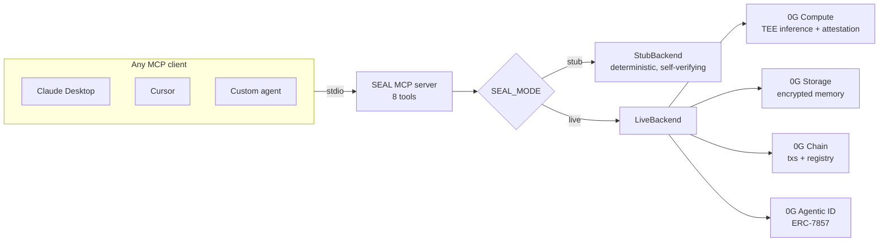

# SEAL 🔏 — 0G as MCP tools

**Add one config line and your Claude / Cursor / ChatGPT gets private inference,
permanent encrypted memory, and proof of every answer.**

SEAL is an MCP server exposing the 0G stack — Compute (TEE inference), Storage
(encrypted memory), Chain (transactions), Agentic ID (agent identity) — as 8 tools any
AI client can call. `seal_verify` is the differentiator: **any client can verify any
OTHER agent's attestation**, which makes SEAL a trust primitive, not an API wrapper.

## Architecture



## Tools

| Tool | In | Out |
|---|---|---|
| `seal_infer` | `{prompt, model?}` | `{output, attestation, txHash?}` |
| `seal_memory_put` | `{key, value}` | `{cid, encrypted: true}` |
| `seal_memory_get` | `{key}` | `{value}` |
| `seal_memory_list` | `{prefix?}` | `{keys[]}` |
| `seal_agent_mint` | `{name, meta}` | `{agenticId, explorerUrl}` |
| `seal_agent_load` | `{agenticId}` | `{meta, memoryRoot}` |
| `seal_chain_call` | `{to, data, value?}` | `{txHash}` |
| `seal_verify` | `{attestation}` | `{valid, model, timestamp}` |

## Quickstart

```bash
bun install
bun test              # 6 tests: attestation validity/tamper, memory, identity, chain
bun run goldfish      # minimal example agent: mint → infer → remember → prove
bun start             # run the MCP server on stdio (SEAL_MODE=stub|live)
```

### Claude Desktop / Claude Code

```json
{ "mcpServers": { "seal": { "command": "bun", "args": ["/path/to/packages/seal/src/index.ts"] } } }
```

### Cursor (`.cursor/mcp.json`)

```json
{ "mcpServers": { "seal": { "command": "bun", "args": ["packages/seal/src/index.ts"] } } }
```

## Example agents

1. **`examples/goldfish.ts`** — a goldfish with permanent memory (~20 lines): mints an
   Agentic ID, runs sealed inference, stores the thought, recalls it, verifies its own
   attestation. `bun run goldfish`.
2. **AM I COOKED?** (`apps/web` in this monorepo) — the flagship: contains **zero 0G SDK
   imports**; every 0G call goes through SEAL.

## Modes

- `SEAL_MODE=stub` (default): deterministic backend with **self-consistent fake
  attestations** — `seal_verify` really validates what `seal_infer` emits and rejects
  tampering, so agent logic built today ports to live 0G without code changes.
- `SEAL_MODE=live`: real 0G backends. Requires `OG_RPC_URL, OG_PRIVATE_KEY,
  OG_COMPUTE_ENDPOINT, OG_STORAGE_ENDPOINT`. Until wired, every live call fails loudly
  naming exactly what's missing — no silent fakes in live mode, ever.
